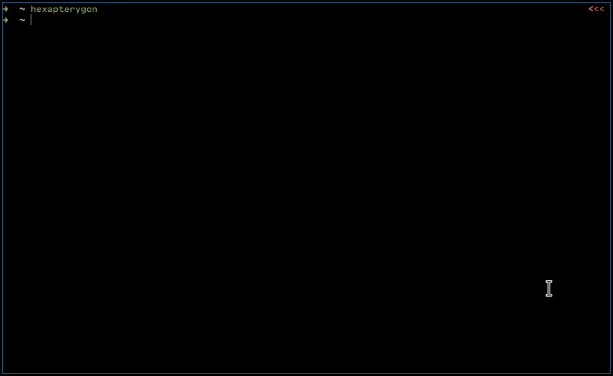

<div align="center">
<h3>
  <a href="">HEXAPTERYGON</a> <h5>Unleashing the power of self destruction</h5>
</h1>
<p>
    <a href="https://github.com/GiorgosXou/hexapterygon/pulse">
      
    </a>
    <a href="https://github.com/GiorgosXou/hexapterygon/blob/master/LICENSE">
      
	</a>

</p>
<h1></h1>
</div>

Less bloatware, less spyware, improved privacy and performance from within the experience of your stock ROM. **A user-friendly** all-in-one cross-platform, *([uni-curses](https://github.com/unicurses/unicurses) compatible component, module and uitility)* software for orchestrating and debloating your Android devices from unwanted pre-installed crap.


# 📦 Features
- ***Current:***
- - [Uni-curses](https://github.com/unicurses/unicurses) compatible component
- - Auto removes-installs-executes
- - User-friendly \ easy-to-use
- - [Fixed-version pkg control](#-questions)
- - Can be used as a module
- - Cross-platform
- ***Future:***
- - Rooting
- - Restoring 
- - Better Security
- - Better User-Interface
- - [More auto-debloating lists](https://github.com/GiorgosXou/hexapterygon/tree/main/device_repo_lists)


# ⚙️ Configure

Before begining the process of debloating, make sure you:

- Backed-up your personal data *(Advised)*
- `pip install hexapterygon --upgrade`
- Have [Android SDK Platform Tools](https://developer.android.com/studio/releases/platform-tools) installed 
- Enabled `developer mode` & `USB debugging` *(under settings)*
- Enabled [Security settings](## 'Allow granting permissions and simulating input via USB (if possible)') & [Install via USB](## '[INSTALL] installing won\'t work if it is not enabled') *(optionally, [usually necessary])*
- Disabled services under `setting > ... > Device admin apps` *(optionally)*

*<sup>[click here for more informations](#💭-questions)</sup>*

# 💥 Debloat
To begin the proccess of debloating you either just run `hexapterygon` in your terminal *(while your device is connected and configured)* or `hexapterygon`  and the path-*(file\folder)* or repository to you debloating list(s) like:

```terminal
$ hexapterygon username/my_repository
```
```terminal
$ hexapterygon ./my_debloating_list.txt
```
```terminal
$ hexapterygon ./folder_full_of_lists_named_by_type_identifier_txt
```
[📝 *(Lists should be in this form)*](https://github.com/GiorgosXou/Our-Xiaomi-Redmi-5A-riva-debloating-list/blob/main/devices/Xiaomi%20Redmi%205A%20riva.txt) | 📱 [Demonstration of results](https://odysee.com/hexapterygon:9)



# 🫴 Contribute
### 📜 Debloating lists
Your lists is what makes this tool actually powerfull and user-friendly, without your list-contributions this tool can't work standalone. To contribute a list you just need to:

- ***Create a new repository with a folder called `devices` where you:***
- - Create your debloating-list(s) in the form of `{type_identifier}.txt` 
- - - (use: `hexapterygon --getid` to get the `{type_identifier}`)
- - - [(Take this list as an example)](https://github.com/GiorgosXou/Our-Xiaomi-Redmi-5A-riva-debloating-list/blob/main/devices/Xiaomi%20Redmi%205A%20riva.txt)
- ***Make a pull-request or open an issue and:*** 
- - ask to add your repo (see `device_repo_lists`)

And you are done

### 💻 To the code
Propose whatever you want, just don't mess up with my weird indentation :P

# 🗺️ Documentation
The only documentation that you need is the code itself. JK, it is under construction 🛠️🏗️

# 🔍 Research
My research can be found under my personal debloating list [here](https://github.com/GiorgosXou/Our-Xiaomi-Redmi-5A-riva-debloating-list/#research) 

# 💭 Questions

<details>
<summary><i>How do I install <a href="https://developer.android.com/studio/releases/platform-tools" target="_blank">Android SDK Platform Tools</a>?</i></summary>

> You either manually download the tools from the link above and install them or use your package manager to install them like for example: `sudo pacman -S android-tools` *(following this [video for windows](https://www.youtube.com/watch?v=26GI3z6tI3E))*

</details>
<details>
<summary><i>How do I make sure <a href="https://developer.android.com/studio/releases/platform-tools" target="_blank">Android SDK Platform Tools</a> and `adb` are installed?</i></summary>

> Just run `hexapterygon` or the command `adb shell` while the phone is connected *(with `USB debugging` already enabled)*, a pop-up message on you phone should show-up, to allow the computer to connect to it

</details>
<details>
<summary><i>Where are `Device admin apps` and what do I disable?</i></summary>

> Somewhere under settings, depends on the device. 

</details>
<details>
<summary><i>Why do I get a `github.GithubException.RateLimitExceededException` and what can I do?</i></summary>

> Most probably because you exceeded the github's limit for requests without a token. To solve this, you can either restart your rooter or provide a classic github-token *(without any special permissions checked)*

</details>
<details>
<summary><i>How do I get the {type_identifier}?</i></summary>

> Just run the command `hexapterygon --getid` *(while your authorized device is connected)*

</details>
<details>
<summary><i>How do I use version control for a package?</i></summary>

> Simply do `my.package.name|v` where v is the version-number

</details>


<!-- # 🔍 Research :P no! i have done way more reasearch --> 
<!-- - ***ADB Related:*** -->
<!-- - - ***Python Libraries:*** -->
<!-- - - - [pure-python-adb *(Currently using)*](https://github.com/Swind/pure-python-adb) -->
<!-- - - - [adbutils](https://github.com/openatx/adbutils) -->
<!-- - - - [adb_shell](https://github.com/JeffLIrion/adb_shell) -->
<!-- - - - [python-adb](https://github.com/google/python-adb) -->
<!-- - - ***Questions:*** -->
<!-- - - - [Get application version name using adb](https://stackoverflow.com/questions/11942762/get-application-version-name-using-adb) -->
<!-- - ***XDA:*** -->
<!-- - - ***Random:*** -->
<!-- - - - [Packages which are safe to remove and a few problems.](https://forum.xda-developers.com/t/packages-which-are-safe-to-remove-and-a-few-problems.4006171/) -->
<!-- - - - [Uninstall bloatwares No root](https://forum.xda-developers.com/t/uninstall-bloatwares-no-root.4321387/) -->
<!-- - - - [Question Debloating Mi 11](https://forum.xda-developers.com/t/debloating-mi-11.4242883/) -->
<!-- - - - [Other](https://forum.xda-developers.com/t/delete-this.4203903/page-2) -->
<!---->

# 💗 Donate
- ***[PayPal Address](https://www.paypal.com/donate/?hosted_button_id=XLWAVDMHBYACY)***
- ***Monero Address:*** `83dxyGp3oemQvPBNKiBy61eFX9GZWruEjcNyNH2Dmgiu3HDaZ8REaoYVpGTb3AHR5ccitoKtH53wdQUN3tBJN8aMFMxhWAt`

# 🕳️ Outro
For those wondering: "Debloating Android Devices" = "Uninstalling\Deleting preinstalled unwanted data-collecting\spyware apps and etc." = "better performance" = "Unleashing the power of self destruction"

Here's some reminders *(related to phone companies)*:
- [Greek wiretapping case 2004–05](https://en.wikipedia.org/wiki/Greek_wiretapping_case_2004%E2%80%9305)
- [Huawei Security Scandal](https://www.forbes.com/sites/kateoflahertyuk/2019/02/26/huawei-security-scandal-everything-you-need-to-know/?sh=4a1946e473a5)
- [(Apple's) Batterygate](https://en.wikipedia.org/wiki/Batterygate)

<!-- Disable all permissions for as many apps as possibly you can. -->
<!-- https://www.instagram.com/p/Cq0V-twIIej/ -->

